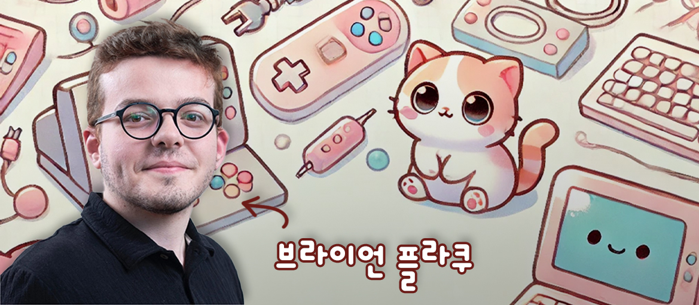

# 🧠 Welcome to my jar—where thoughts swim free!

## 📚 About Me

Hello! I'm Braian, a dedicated and passionate student pursuing a double major in Electrical Engineering and Business Informatics. Currently, I'm on an exciting exchange semester in South Korea, where I'm immersing myself in a new culture while expanding my academic and professional horizons.

- **Current Location:** Austria
- **Home University:** University of Applied Sciences Vorarlberg
- **Exchange University:** Seoul National University of Science and Technology
- **Expected Graduation:** June 2025

## 🎓 Education

### University of Applied Sciences Vorarlberg
**B.Sc. in Electrical Engineering**
September 2022 - Present

**B.Sc. in Business Informatics**  
September 2023 - Present

## 🛠️ Skills

- **Electrical Engineering:**
  - Circuit Design, Control Systems
  - Signal Processing, Power Systems
  - Embedded Programming

- **Business Informatics:**
  - Business Process Management, Data Analysis
  - Software Development, ERP Systems

- **Languages:**
  - English (Fluent)
  - German (Native)
  - Albanian (Native)
  - Italian (Basic)
  - Korean (Basic)

## 📬 Contact Me

---

*Feel free to reach out for collaborations, internships, or just a friendly chat about technology and business!*

---

*This portfolio is a work in progress. Check back for updates as I continue my journey in South Korea and beyond!*

