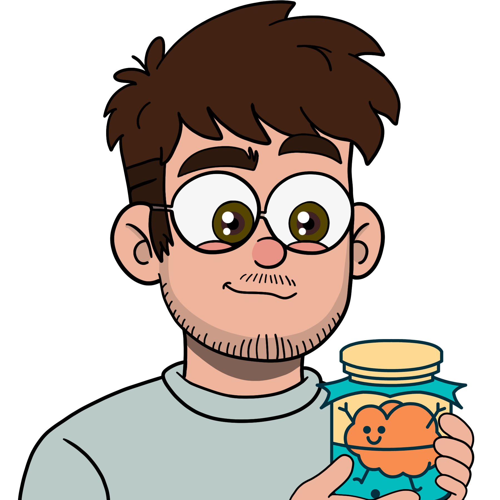

### Braian Plaku

Machine vision engineer at [Blum](https://www.blum.com) · M.Sc. Artificial Intelligence at [JKU Linz](https://www.jku.at/)

&nbsp;
&nbsp;

I design and build deep learning pipelines, and imaging software for industrial production. Currently finishing my master's in Artificial Intelligence. When something catches my interest outside of work, it usually turns into a side project.
 

### Tech

 

### Side Quests

<table>
<tr><td><b><a href="https://github.com/swimmingbrain/texbrain">texbrain</a></b></td><td>Browser based, local LaTeX editor with live preview and git integration</td></tr>
<tr><td><b><a href="https://github.com/swimmingbrain/chingumat-e">chingumat-e</a></b></td><td>Open source foot controlled rhythm game</td></tr>
<tr><td><b><a href="https://github.com/swimmingbrain/decoding-diabetes">decoding-diabetes</a></b></td><td>Diabetes risk prediction on CDC BRFSS data using ensemble methods</td></tr>
<tr><td><b><a href="https://github.com/swimmingbrain/vimaya-homepage">vimaya</a></b></td><td>Mobile app with C# backend and React Native frontend</td></tr>
<tr><td><b>klimaTree</b></td><td>3D printed indoor climate monitor with environmental sensors (1st place, Jugend Innovativ 2022)</td></tr>
</table>

[All repositories &rarr;](https://github.com/swimmingbrain?tab=repositories)
